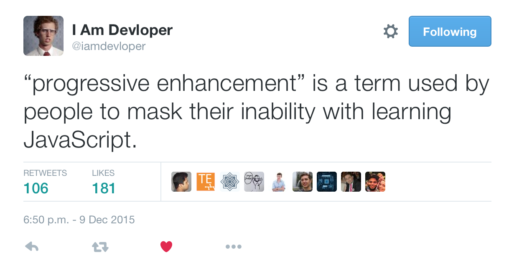
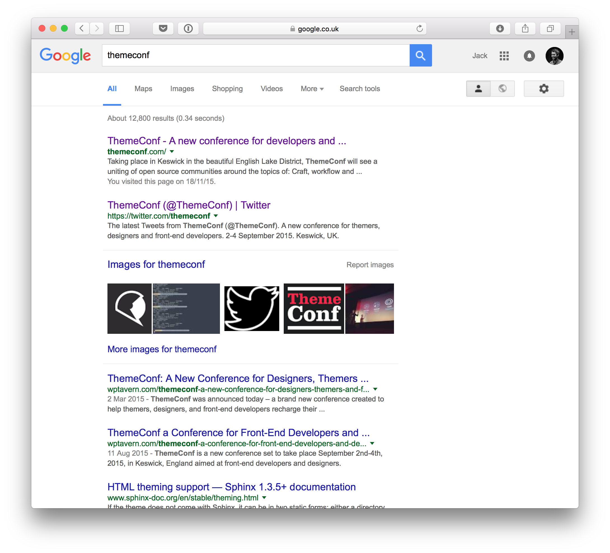
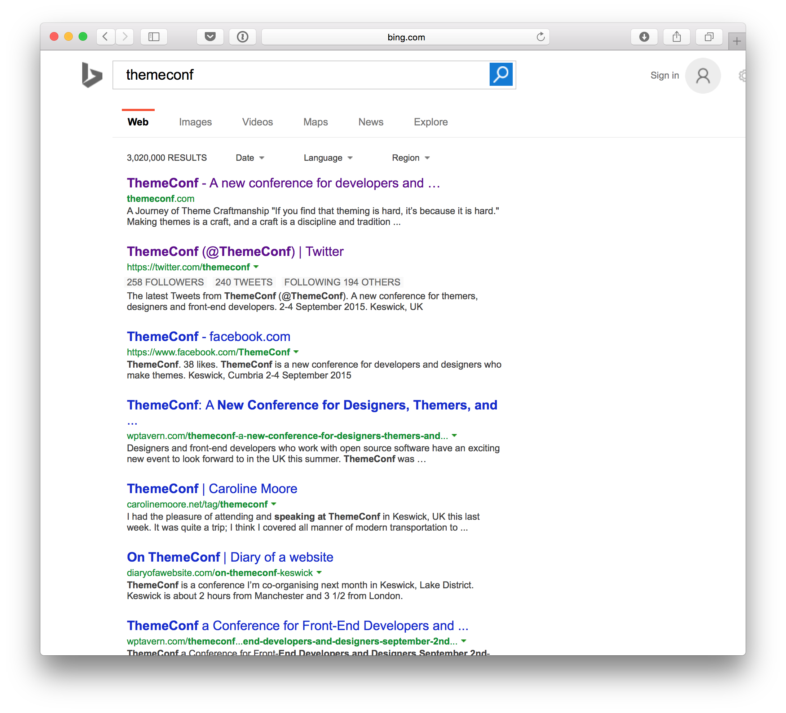
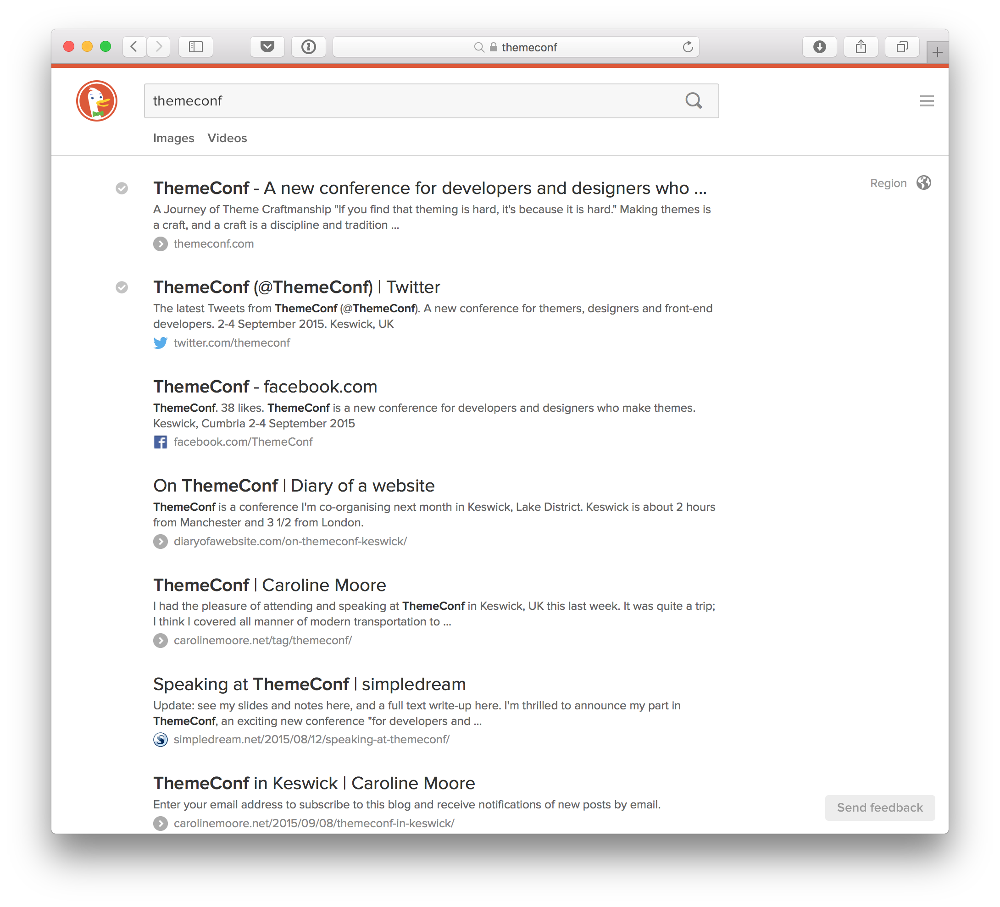

autoscale: true
build-lists: true

# [fit] There and back again,
# [fit] __a developer's tale__

### By __*Jack Lenox*__

^ Hello, Jack Lenox, work for Automattic.

^ Been tinkering with WordPress themes and REST APIs for what seems like forever.

^ This talk is about lessons learned. But in a way I feel like I'm still at the very beginning of learning about this topic.

---

# The __*facts*__

- Using websites often sucks.

- Connections can be crappy.

- Page load times can be slow.

- Not always a continuous user experience.

^ More often than we would like

^ Difficult to create continuous user experiences.

---

# The state of __*JavaScript*__

- [Google Play/Docs](http://google.com)
- [Instagram](http://instagram.com/)
- [UCLA School of the Arts & Architecture](http://www.arts.ucla.edu)

^ So, I won't launch into a full-on talk about JavaScript, but rather its current level of adoption on the web.

^ Lots of JS-based apps are maturing now. Google Play apps (music, movies), and Docs.

^ Instagram's web view is essentially one big SPA.

^ Being adopted in more mainstream web development, UCLA for example.

---

# __*JavaScript*__ & __WordPress__<br /><sup>(plus REST API)</sup>

- [Quartz](http://qz.com)
- [ustwo](http://ustwo.com)
- [Calypso](https://github.com/Automattic/wp-calypso)

^ And this trend is already rippling through the WordPress ecosystem.

^ Quartz, an example I've used previously. Great site, nice to use, very good mobile experience.

^ Ustwo, a new example, site worked on with Human Made. Beautiful interface, continuous experience.

^ And of course, big app projects like Calypso.

---

# [fit] **Single-page** applications

^ Not a very good name, but it is what it is

---

# **Single-page** applications

- Historically, __*well*__ criticised.

- Have been maturing over a __*long*__ period of time now.

- Not necessarily suited to every case, but more __*maligned*__ than they deserve.

^ Historically criticised.

^ Maturing.

^ More maligned than deserved.

---

# Well-documented __*downsides*__

- Search Engine Optimisation
- Client/server code partitioning
- Browser history
- Analytics
- Speed of initial load

^ SEO

^ Client/server code partitioning

^ Browser history

^ Analytics

^ Speed of initial load, back and forth, load JS, then load resources etc.

^ Discuss each one.

---

# But __*hang*__ on?

- HTML5
- HTTP/2
- Node.js

^ HTML5, host of browser APIs, many specifically designed to mitigate these issues.

^ HTTP/2, speeds up connections. Initial load etc.

^ What's this Node I've been hearing about? Doesn't it fix everything?

^ "progressive enhancement" sometimes used as reins to try to hold back ambition.

---



---

# Without JavaScript, things are getting __*harder*__

- Service Worker.
- Push notifications.
- User expectations.

^ Service worker, JS API (like other HTML5 stuff).

^ Same with push.

^ How long is it before clients ask what will happen if user is offline?

---


^ Bit like responsive design. Coined by Ethan Marcotte five years ago. Even non-web people know what this is now.

---


## Nice, but is it responsive?

---

# [fit]Marrying __*WordPress*__ and<br />**single-page** applications?

^ So, bearing all of this in mind, how do these two worlds collide?

---

# **Single-page** themes?

^ Maybe, I think so, downsides...

---

# Let's __*recap*__

The problems with **single-page** applications:

- Search Engine Optimisation
- Client/server code partitioning
- Browser history
- Analytics
- Speed of initial load

^ With WordPress, we don't really have these problems right now.

^ In fact WordPress's key strengths revolve around it being relatively good out of the box in terms of SEO, speed, analytics and code partitioning (ahem).

---

# The path to enlightenment

Search Engine Optimisation

Client/server code partitioning

Browser history

Analytics

Speed of initial load

^ So, let us embark on the path to enlightenment.

---

# The path to enlightenment

Search Engine Optimisation

Client/server code partitioning

__*Browser history*__

__*Analytics*__

Speed of initial load

^ Let's take two  of the easier things to deal with, browser history and analytics.

^ The good news here is HTML5 brought with it the History API, and this is available across all browsers except IE8 and 9.

---

# Browser history and analytics

History API[^1]:

```javascript
var state = { 'post_id': 1234 };
var title = 'A Day of Rest';
var url = 'a-day-of-rest';

history.pushState( state, title, url );
```

[^1]: For more information on this, check out the [MDN History API docs](https://developer.mozilla.org/en-US/docs/Web/API/History).

^ Voila.

^ Try this in the console. It's cool! Been around for years.

^ If you do need to support IE8/9, you can also spoof this effect using hashes instead of actual state changes. Hash changes are automatically stored in the browser history for all browsers.

---

# The path to enlightenment

Search Engine Optimisation

Client/server code partitioning

Speed of initial load

---

# The path to enlightenment

Search Engine Optimisation

__*Client/server code partitioning*__

Speed of initial load

^ This one's a bit trickier. And what do we mean by it?

^ We don't want to have to maintain two different sets of template code – within PHP and JS.

---

# Client/server code partitioning

Handlebars or Mustache:

```handlebars
<article id="post-{{id}}" {{post_class}}>
	<header class="entry-header">
		<h1 class="entry-title">{{the_title}}</h1>
	</header>

	<div class="entry-content">
		{{the_content}}
	</div>
</article>
```

^ Debate around WordPress templating language anyway. Timber/Twig?

^ Yes, PHP started as a templating language. It's not really a templating language any more. Or at least if it is, it's a far cry from logic-less templating languages like Mustache.

---

# Client/server code partitioning

React:

```javascript
<article id="post-{ this.props.ID }" { this.props.postClass }>
	<header class="entry-header">
		<h1 class="entry-title">{ this.props.title }</h1>
	</header>

	<div class="entry-content">
		{ this.props.content }
	</div>
</article>
```

^ This can be rendered server-side with Node.js.

^ I'll come back to how this can specifically solve the server/client problem.

---

# The path to enlightenment

Search Engine Optimisation

Speed of initial load

---

# The path to enlightenment

__*Search Engine Optimisation*__

Speed of initial load

^ This is a primary concern that folks often raise.

---

# Search Engine Optimisation

Google, Bing and DuckDuckGo can already crawl JS rendered sites.

^ So actually it's fine right?

---



---



---



^ But this isn't quite good enough!

^ Ideally, we want to be more imperative with search engines.

^ Also, while it's true that search engines can render our sites, lots of other sites can't.

---


^ Like Facebook. So they give us React, but can't handle embedding a JS site. :(

---

# The path to enlightenment

Speed of initial load

---

# The path to enlightenment

__*Speed of initial load*__

^ This is where things get a bit controversial.

^ So, I've said that Node.js is able to render server-side.

^ But, for most WordPress environments, this means setting up a separate Node server, learning how to use Node etc.

^ Why not use the data that WordPress already gives us. Any page load within the WordPress environment will by default include a loop with all of the relevant data to any given permalink

---

# Speed of initial load

Automatically generate PHP from your JS:

```javascript
var markup = "<?php get_header();" +
			React.renderToString( post({ title: 'the_title',
			content: 'the_content' }) ) +
			"<?php get_footer(); ?>";

markup = markup.replace( /the_title/gi, '<?php the_title(); ?>' );
markup = markup.replace( /the_content/gi, '<?php the_content(); ?>' );

fs.writeFileSync( 'single.php', markup );
```

^ We automatically generate PHP from JavaScript.

^ We run this, or something like it in our Grunt file, or Gulp file, or Webpack etc.

^ I'm using React, but there are equivalent ways of doing this with Ember, Angular (and even Elm).

^ Using something like JSdom there's no reason why you wouldn't be able to do this with any library.

^ Such tools are already JS-based so we can do whatever we wanna do, god!

^ Our PHP becomes as trivial as the CSS file that our Sass or Less might generate.

---

# So how to proceed?

No more excuses. Just do it!

---

# ಠ_ಠ

^ Yes, you.

---

# But *wait*, there's more!

^ One last thing, well a couple more things...

---

# __*Don't*__ run ajax on every page

^ Something that I have become very aware of from working on WordPress VIP.

---

# Bootstrap

```php
// functions.php
$bootstrap = array();

global $wp_query;

while ( $wp_query->have_posts() ) {
	$wp_query->the_post();
	$bootstrap[] = array(
		"id" => get_the_ID(),
		"title" => array(
			"rendered" => get_the_title()
		)
	);
}

$bootstrap_json = json_encode( $bootstrap );

wp_register_script( 'bs-script', ... );
wp_localize_script( 'bs-script', 'bootstrap_json', $bootstrap_json );
wp_enqueue_script( 'bs-script' );
```

^ Step through.

---

# [fit] What about *all* the<br />other options?

^ Permalink structure?

^ Static page on front?

---

# Localise all the things

```php
$permalink_structure = get_option( 'permalink_structure' );

$show_on_front = get_option( 'show_on_front' );

$page_on_front = get_option( 'page_on_front' );
```

---

## Further reading

- github.com/humanmade/feelingrestfultheme
- egghead.io/instructors/dan-abramov
- github.com/ryelle/Anadama-React
- github.com/Automattic/wp-calypso
- (github.com/jacklenox)
- themeshaper.com/2015/11/23/javascript-theme-tutorial/

^ The site for this conference is built with React and Redux. I'd highly recommend checking it out.

^ Kelly Dwan, colleague at a8c, doing some very interesting experiments. She writes much cleaner code than me.

^ Calypso!

^ If you're a masochist, you can follow me.

^ Check out ThemeShaper!

---

# The End

@__*jacklenox*__

- automattic.com/work-with-us/

^ I'm around everywhere, but seriously don't follow me. You'll regret it.

^ We're always hiring.

^ # [fit] `(╯°□°)╯︵ ┻━┻`

^ # Some JS

^ ```javascript
^ if ( true === false ) {
^ 	var theWorldIsUpsideDown = true;
^ }
